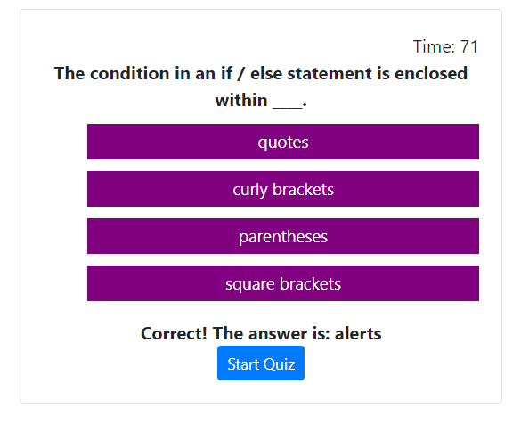

# homework4

By Jakub Marchel 

We have been tasked with creating a timed code quiz. The quiz consists of (5) multiple choice questions wherein only 1 questions is shown at a time. The next question will populate the screen once the current question has been answered. The quiz will keep track on how many correct and incorrect question you have at the end of the quiz, as well as taking the time left on the counter once the quiz is completed as a score. Please note that for each incorrect answer, you will be deducted 10 seconds from the counter. The highscores will then be tracked and the quiz can be taken as many times with the ability to compare the previous scores. You can also clear all the previous highscores and start from a clean slate. 

The code quiz is utliziing Bootstrap and is resposive for desktop and all mobile deivces. 

